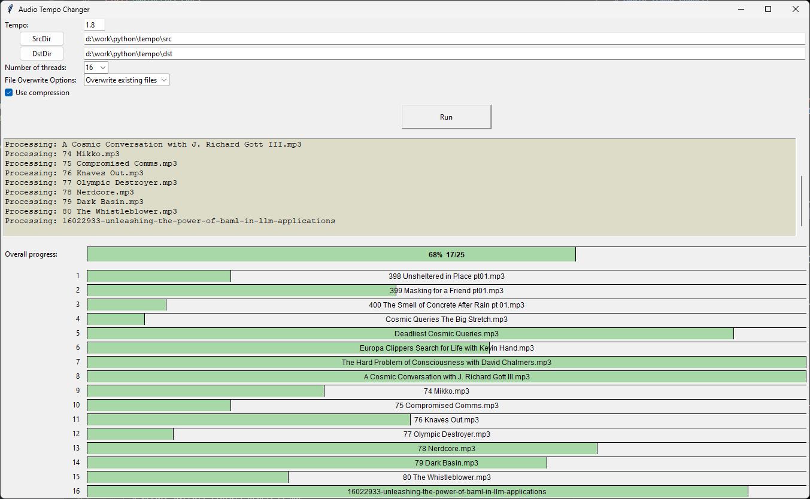

# Audio Tempo Processor

A Python GUI application that allows you to batch process audio files by changing their tempo with optional compression to reduce file size. The application uses FFmpeg for audio processing in multi-threading mode and supports multiple audio formats. It is most useful for processing podcasts and audiobooks.



## Features

- Change audio files tempo (with preserving the pitch)
- Batch processing with multi-threading support
- Optional audio compression
- Supports multiple audio formats (MP3, M4A, M4B, WAV, OGG, FLAC)
- Dynamic progress tracking for individual files and overall progress, based on processed size feedback from FFMPEG
- Configurable file overwrite behavior (Skip/Overwrite/Rename)
- Settings persistence between sessions (saves its configuration in config file)

## Requirements

- Python 3.x
- FFmpeg executable
- Python packages:
  - tkinter (usually comes with Python)
  - tinytag
  - configparser

## Installation

1. Ensure Python 3.x is installed on your system
2. Download and install FFmpeg
3. Install required Python packages:
   ```bash
   pip install tinytag
   ```
4. Download `tempo.py` and run it

## Configuration

The application saves its configuration in `tempo_config.ini` file, which includes:
- FFmpeg path
- Last used input (source) and output (destination) directories
- Tempo value
- Number of processing threads
- Overwrite options
- Compression settings

## Usage

1. Set the FFmpeg path (first time only)
2. Select source directory containing audio files
3. Select destination directory for processed files
4. Adjust tempo value (0-2, where 1 is normal speed)
5. Choose number of processing threads (1-DFLT_N_THREADS_MAX)
6. Select file overwrite behavior:
   - Skip existing files
   - Overwrite existing files
   - Rename existing files
7. Optionally enable compression
8. Click "Run" to start processing

## Processing Options

- **Tempo**: Value between 0 and 2
  - < 1: Slower playback
  - 1: Normal speed
  - > 1: Faster playback
- **Threads**: 1-DFLT_N_THREADS_MAX concurrent processing threads
- **Compression**: Optional audio compression to reduce file size
- **Overwrite Options**:
  - Skip: Preserve existing files
  - Overwrite: Replace existing files
  - Rename: Add number suffix to new files

## FFMPEG parameters

The FFMPEG command used for tempo (without compression) is the following:
   ```
   # Cmd example: ffmpeg.exe -i i.mp3 -codec:a libmp3lame -q:a 7 -ar 22050 -filter:a atempo=1.8 -vn -hide_banner -loglevel error -stats o.mp3 -y
  ffmpeg_command = [
    str(self.ffmpeg_path.get()),
    "-i", src_file_path,  # input file
    "-filter:a", f"atempo={self.tempo.get()}",  # tempo audio filter
    "-vn",  # Disable video stream
    dst_file_path,  # output file
    "-y",  # Force overwrite output file
    # To minimize FFmpeg’s output and only show the line with progress updates
    "-hide_banner",
    "-loglevel", "error",
    "-stats",
  ]
  ```
When **Compression** is enabled, additional parameters are added:
  ```
  # Compression cmd example: "codec:a libmp3lame -q:a 7 -ar 22050"
  # Full cmd example: ffmpeg.exe -i i.mp3 -codec:a libmp3lame -q:a 7 -ar 22050 -filter:a atempo=1.8 -vn -hide_banner -loglevel error -stats o.mp3 -y
  if self.use_compression_var.get():
    ffmpeg_compression_params = [
      "-codec:a", "libmp3lame",  # LAME (Lame Ain't an MP3 Encoder) MP3 encoder wrapper
      "-q:a", "7",  # quality setting for VBR
      "-ar", "22050"  # sample rate
    ]
    # Insert after "src_file_path" before "-filter:a"
  ```
## Logging

The application logs processing details and errors to `tempo_log.txt` file ('INFO' or 'DEBUG' modes).